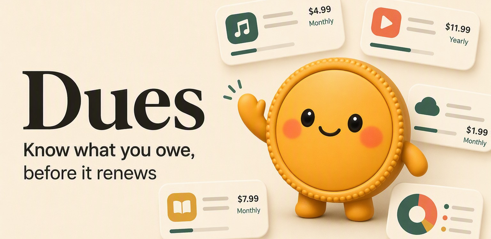
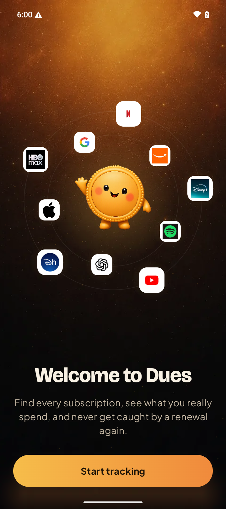
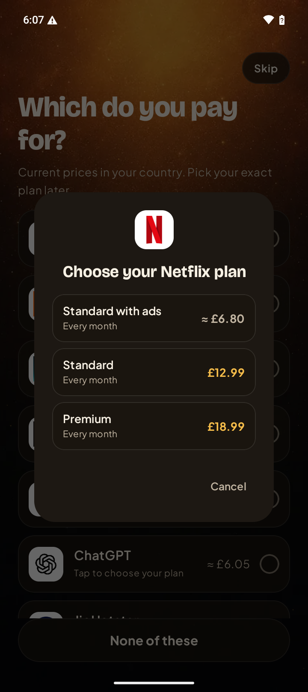
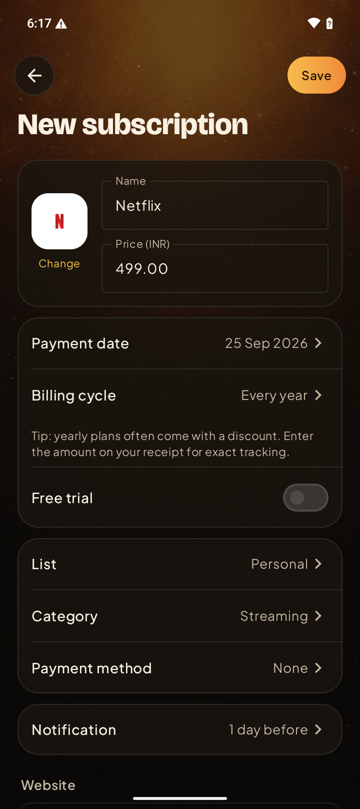

<p align="center"></p>

<h1 align="center">Dues – Free Subscription Tracker for Android</h1>

<p align="center"><b>Know what you really pay for subscriptions, and get reminded before every renewal.</b><br>
Free · Private · Open source · by <a href="https://github.com/PennyLume-dev">Pennylume</a></p>

<p align="center">
  <a href="../../releases/latest"></a>
  <a href="../../releases"></a>
  <a href="LICENSE"></a>
  
  
  <a href="https://dues-app.vercel.app/donate"></a>
</p>

<p align="center">
  <a href="../../releases/latest"><b>⬇ Download the APK</b></a> ·
  <a href="https://dues-app.vercel.app">Website</a> ·
  <a href="https://dues-app.vercel.app/donate">Support Dues</a> ·
  <a href="../../issues/new/choose">Report a price</a>
</p>

---

Small subscriptions add up quietly. **Dues** is a free subscription manager and renewal reminder for Android: add Netflix, Spotify, ChatGPT, YouTube Premium, iCloud+, Disney+, Amazon Prime and 60+ more services, and it shows your **real monthly and yearly spend** with **verified local prices**, then reminds you **before every charge or free-trial end**.

No account. No ads. No in-app purchases. Your data never leaves your phone.

## Screenshots

<p align="center">
  
  
  
</p>

## Features

| | |
|---|---|
| 🧾 **69 services built in** | Real plan names and prices, from Netflix and Spotify to ChatGPT, Claude, iCloud+ and Xbox Game Pass |
| 🌍 **Verified prices in 12 countries** | US, India, UK, Germany, France, Canada, Australia, Singapore, UAE, Brazil, Japan, Mexico; live currency conversion everywhere else |
| 🔔 **Renewal & free-trial reminders** | Get notified days before you're charged, so you can cancel in time |
| 📊 **Spending orbit & yearly totals** | See where your money goes by category, month and year |
| 📅 **Payment calendar** | Every upcoming charge on one calendar |
| 🔒 **Private by design** | No account, no analytics, no ads; data stays on the device, with CSV export for backups |
| 💸 **Free forever** | Every feature, unlimited subscriptions, no paywall |

## Download

1. Open the [latest release](../../releases/latest) on your Android phone (Android 8.0 or newer).
2. Download `Dues-v*.apk` and open it. Allow your browser to install apps when asked.
3. Pick your country, tap the services you pay for, done.

Google Play listing coming soon.

## Support Dues

Dues is free and made by a tiny independent studio. If it saves you money:

- ⭐ **Star this repo.** It helps other people find Dues.
- 💬 **Share it** with a friend who has too many subscriptions.
- 🧾 **Report a wrong price** with the [price template](../../issues/new/choose).
- ☕ **Send a tip** on the [support page](https://dues-app.vercel.app/donate). Tips unlock nothing; everything stays free.

## FAQ

**Is Dues really free?** Yes. No ads, no in-app purchases, no subscription limit.

**Does Dues upload my data?** No. There is no account and no server; your subscriptions stay on your phone.

**Which countries have verified prices?** US, India, UK, Germany, France, Canada, Australia, Singapore, UAE, Brazil, Japan and Mexico. Other countries see prices converted from USD at live exchange rates.

**Can Dues cancel a subscription for me?** No. It reminds you before you're charged; you cancel with the provider and mark it cancelled in Dues.

**Is there an iPhone version?** Not yet. Dues is Android only for now.

## Contributing

Price fixes are the most valuable contribution. See [CONTRIBUTING.md](CONTRIBUTING.md) for the catalog format and code guidelines, and pick up a [`good first issue`](../../labels/good%20first%20issue).

### Build from source

Requirements: JDK 17 and Android SDK 36.

```bash
./gradlew assembleDebug        # debug APK
./gradlew testDebugUnitTest    # unit tests
```

Optional `local.properties` entries:
- `LOGO_DEV_KEY` – publishable [logo.dev](https://logo.dev) key for service logos (falls back to favicons).
- `RELEASE_STORE_FILE`, `RELEASE_STORE_PASSWORD`, `RELEASE_KEY_ALIAS`, `RELEASE_KEY_PASSWORD` – for signed release builds.

**Tech:** Kotlin · Jetpack Compose · Material 3 · Room · WorkManager · Coil.
Prices live in [`app/src/main/assets/catalog.json`](app/src/main/assets/catalog.json); the app also downloads the newest copy from the website.

## License

The code is licensed under the **GNU GPL v3.0** (see [LICENSE](LICENSE)).

The **"Dues" name, app icon, logo and the Penny mascot artwork** are trademarks of Pennylume and are **not** covered by the GPL. Forks must use their own name and artwork. Service names and logos belong to their owners; Dues is not affiliated with the services it tracks.
